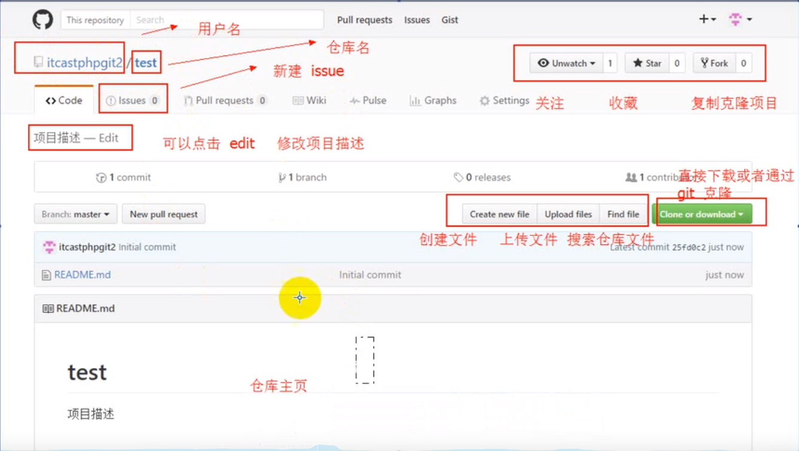

# 学习使用GitHub

## 1.目的

借助GitHub托管项目代码

## 2.基本概念

### 仓库（Repository）

​		仓库用来存放项目代码，每个项目有一个仓库

### 收藏（Star）

​		收藏项目，方便下次查看

### 复制与克隆项目（Fork）

​		复制别人的仓库。且独立存在

### 发起请求（pull Request）

​		李四通过fork复制了张三的仓库，当李四对从张三哪里复制来的在仓库做修改时，张三的仓库是不会修改的，所以李四用**pull Request**对张三发起请求，张三看到后，感觉不错就会接收请求，原有项目就会同步了。

### 关注（Watch）

​		如果你watch了某个项目，那么以后只要这个项目有任何更新，你都会收到关于这个项目的通知提醒

### 事务卡片（lssue）

​		发现代码BUG时，但是目前还没有成型的代码，需要讨论时使用；

### Github主页

​		账号创建成功或点击网址导航栏github图标都可进入github主页:该页左侧主要显示用户动态以及关注用户或关注仓库的动态;右侧显示所有的git库

### 仓库主页

​		仓库主页主要显示项目的信息，如:项目代码，版本，收藏/关注/fork情况等

### 个人主页

​		个人信息:头像，个人简介，关注我的人，我关注的人，我关注的git库，我的开源项目，我贡献的开源项目等信息

---

## 3.注册GitHub

[GitHub官网](https://github.com/)

### 注意

  + GitHub是外国的，可以翻墙要快一些
  + 邮箱可以填QQ邮箱，不要前面的`WWW.`,需要验证

##  4.创建仓库

	####  说明
	
		+  一个仓库对应一个开源项目

  +  可以通过git来管理仓库

### 操作

​		右上角+号-->点击new Repository

# 安装使用git

## 1.目的

通过git管理GitHub托管项目代码

## 2.下载安装

[官网](https://git-scm.com/)

## 3.基本工作流程

### git工作区域

+ 工作区（Working Directory）
	+ 就是你在电脑上看到的目录，比如目录下testgit里的文件(.git隐藏目录版本库除外)。或者以后需要再新建的目录文件等等都属于工作区范畴。
	
+ 版本库
  + 工作区有一个隐藏目录.git,这个不属于工作区，这是版本库。其中版本库里面存了很多东西，其中最重要的就是stage(暂存区)，还有Git为我们自动创建了第一个分支master,以及指向master的一个指针HEAD。
+ 暂存区
  + 暂存已经修改的文件最后统一提交到git仓库中

### git基础设置

1.设置用户名：`git config --global user.name "luojing"`

2.设置用户邮箱	`git config --global user.email "luojing"`

3.查看设置	`git config --list`

### 初始化一个仓库

1、创建一个文件夹	`mkdir testgit`

2、将该文件初始化成一个仓库	`git init`

**初始化的.git文件用于保存仓库所有信息的**

### 向本地仓库提交文件

添加aaa.txt文件	`touch readme.txt`

提交到暂存区 `git add readme.txt`

提交到git仓库	`git commit -m "提交了readme.txt"`

丢弃工作区的修改`git restore readme.txt`

仅删除暂存区的文件(不影响工作区文件): `git rm --cache 文件名`

**对仓库做修改后再提交一遍就可以同步仓库了**

查看提交的历史记录`git log`

版本号切换`git reset --hard 版本号`

获取所有版本号`git reflog`

### git管理远程仓库

生成公钥和私钥`输入 ssh-keygen ，按三次enter`,再去GitHub仓库setting-》SHH创建一个SHH key填入公钥

---

**如何添加远程库？**

​     现在的情景是：我们已经在本地创建了一个Git仓库后，又想在github创建一个Git仓库，并且**希望这两个仓库进行远程同步**，这样github的仓库可以作为备份，又可以其他人通过该仓库来协作。

本地添加绑定远程仓库`git remote add origin https://github.com/MS-Jing/test.git`

**本地版本库**同步到**远程版本库**: `git push -u origin master`第二次及以后可以使用`git push`

 git 克隆操作`git clone 仓库地址`

## 创建与合并分支

  	在版本回退里，我们已经知道，每次提交，Git都把它们串成一条时间线，这条时间线就是一个分支。截止到目前，只有一条时间线，在Git里，这个分支叫主分支，即master分支。HEAD严格来说不是指向提交，而是指向master，master才是指向提交的，所以，HEAD指向的就是当前分支

**创建并切换分支**：`git checkout -b dev`

创建分支：`git branch dev`

切换分支：`git checkout dev`

**查看所有分支**：`git branch`

**合并分支**：`git merge dev`

**删除分支**：`git branch –d dev`

**处理分支合并时的冲突**，当执行了合并语句后发出冲突，查看当前状态`git status`发现相关文件爆红，手动修改相关文件解决冲突后，再次添加到暂存区`git add xxx`然后`git commit -m "处理了相关文件的冲突再次提交"`提交

## 分支管理

将当前分支工作现场隐藏起来：`git stash`

查看隐藏分支现场：`git stash list`

恢复现场：`git stash pop`

