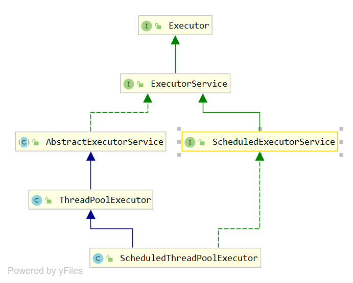

# JUC概述

## 什么是JUC

JUC 是java.util.concurrent工具包的简称。这是一个处理线程的工具，从JDK1.5开始出现的

## 线程和进程

**进程( Process )**是计算机中的程序关于某数据集合上的一次运行活动，**是系**
**统进行资源分配和调度的基本单位**,是操作系统结构的基础。

**线程( thread )是操作系统能够进行运算调度的最小单位。**

## 线程状态

创建、就绪、运行、阻塞、死亡

可以通过Thread类中的State枚举类来看：

```java
public enum State {
    NEW, // 创建
    RUNNABLE, //就绪状态
    BLOCKED, //阻塞状态
    WAITING, //等待状态  一直等，不见不散
    TIMED_WAITING,//等待状态 有个等待时间，过时不候
    TERMINATED; // 停止状态
}
```

## Wait和Sleep方法的区别

+ sleep是Thread方法的今天类，wait是object的方法。
+ sleep不会释放锁，也不需要占用锁。wait会释放锁，但是调用前当前线程拥有该资源的锁（代码需要在synchronized中），可以理解为wait释放锁和cpu而sleep只释放CPU
+ 都可以被interrupted方法中断。

## 并行和并发的区别

并发：同一时刻多个线程访问同一个资源

并行：多项任务同时执行

# Lock锁

## Lock和synchronized区别

+ synchronized是java的关键字，Lock只是一个 接口可以通过实现了该接口的类实现同步操作
+ synchronized在代码块执行结束后自行释放锁，Lock需要用户手动释放锁
+ Lock可以让等待锁的线程响应中断，而synchronized却不行。使用synchronized的等待的线程会一直等待下去，不能响应中断
+ Lock可以知道有没有成功获取到锁，而synchronized却不行
+ Lock可以提高多个线程进行读操作的效率

在性能上来说,如果竞争资源不激烈,两者的性能是差不多的,而当竞争资源非常激烈时(即有大量线程同时竞争) , 此时Lock的性能要远远优于synchronized。

## ReentrantLock

```java
class Ticket {
    private int number = 30;
    private Lock lock = new ReentrantLock();

    public void sale() {
        //加锁
        lock.lock();
        try {
            if (number > 0) {
                System.out.println(Thread.currentThread().getName() + " : 卖出：" + (number--) + " 还剩:" + number);
            }
        } finally {
            //释放锁
            lock.unlock();
        }
    }
}
```

# 线程通信

## synchronized实现

```java
public class Share {
    private int number = 0; //共享资源

    public synchronized void add() throws InterruptedException {
        while (number == 1) {
            this.wait();
        }
        number++;
        System.out.println(Thread.currentThread().getName() + "->" + number);
        this.notify();
    }

    public synchronized void sub() throws InterruptedException {
        while (number == 0) {
            this.wait();
        }
        number--;
        System.out.println(Thread.currentThread().getName() + "->" + number);
        this.notify();
    }

    public static void main(String[] args) {
        Share share = new Share();
        new Thread(() -> {
            try {
                for (int i = 0; i < 10; i++) {
                    share.add();
                }
            } catch (InterruptedException e) {
                e.printStackTrace();
            }
        }, "add").start();
        new Thread(() -> {
            try {
                for (int i = 0; i < 10; i++) {
                    share.sub();
                }
            } catch (InterruptedException e) {
                e.printStackTrace();
            }
        }, "sub").start();
    }
}
```

## Lock实现

```java
public class Share {
    private int number = 0; //共享资源
    private Lock lock = new ReentrantLock();
    private Condition condition = lock.newCondition();

    public void add() throws InterruptedException {
        lock.lock();
        try {
            while (number == 1) {
                condition.await();
            }
            number++;
            System.out.println(Thread.currentThread().getName() + "->" + number);
            condition.signalAll();
        }finally {
            lock.unlock();
        }

    }

    public void sub() throws InterruptedException {
        lock.lock();
        try {
            while (number == 0) {
                condition.await();
            }
            number--;
            System.out.println(Thread.currentThread().getName() + "->" + number);
            condition.signalAll();
        }finally {
            lock.unlock();
        }

    }

    public static void main(String[] args) {
        Share share = new Share();
        new Thread(() -> {
            try {
                for (int i = 0; i < 10; i++) {
                    share.add();
                }
            } catch (InterruptedException e) {
                e.printStackTrace();
            }
        }, "add").start();
        new Thread(() -> {
            try {
                for (int i = 0; i < 10; i++) {
                    share.sub();
                }
            } catch (InterruptedException e) {
                e.printStackTrace();
            }
        }, "sub").start();
    }
}
```


# 集合线程安全问题

我们知道当多个线程向ArrayList中添加数据会造成ConcurrentModificationException异常的问题，而且添加的数据也有问题。

这是因为ArrayList不是线程安全的

```java
public class Test {

    public List<String> list = new ArrayList<>();

    public void add() {
        try {
            TimeUnit.SECONDS.sleep(1);
        } catch (InterruptedException e) {
            e.printStackTrace();
        }
        list.add(Thread.currentThread().getName());
        System.out.println(list);
    }

    public static void main(String[] args) throws InterruptedException {
        Test test = new Test();
        new Thread(()->{
            for (int i = 0; i < 100; i++) {
                test.add();
            }
        },"A").start();
        new Thread(()->{
            for (int i = 0; i < 100; i++) {
                test.add();
            }
        },"B").start();
        new Thread(()->{
            for (int i = 0; i < 100; i++) {
                test.add();
            }
        },"C").start();

    }
}
```

## 解决方案一（Vector）

Vector也是List接口的实现类

我看可以看一下Vector的add方法:

```java
public synchronized boolean add(E e) {
    // 当前列表被修改的次数
    modCount++;
    //判断当前列表是否需要扩容
    ensureCapacityHelper(elementCount + 1);
    // 向列表中添加元素
    elementData[elementCount++] = e;
    return true;
}
```

我们可以看到和ArrayList的很像，但是方法上面添加了synchronized关键字，所以Vector是线程安全的。

## 解决方案二(Collections)

Collections是util包下的他里面有synchronizedList静态方法用来让列表线程安全。我们可以这样来使我们的列表安全：

```java
public List<String> list = Collections.synchronizedList(new ArrayList<>());
```

为什么这样可以让我们的列表线程安全了呢？追进去看看：

```java
public static <T> List<T> synchronizedList(List<T> list) {
    return (list instanceof RandomAccess ?
            new SynchronizedRandomAccessList<>(list) :
            new SynchronizedList<>(list));
}
```

这里先判断当前列表是否是可随机访问的然后返回SynchronizedRandomAccessList和SynchronizedList并把list给了他们（其实SynchronizedRandomAccessList是SynchronizedList的子类）。到这里我们可以猜测他可能是使用了静态代理模式将我们的线程不安全的列表由一个SynchronizedList来进行代理。

我们看看他的构造方法:

```java
SynchronizedList(List<E> list) {
    super(list);
    this.list = list;
}
```

我们追进SynchronizedList的add方法看看:

```java
public void add(int index, E element) {
    //其实追到他的父类mutex 就是this,或者你需要传递一个要同步的对象
    synchronized (mutex) {
        list.add(index, element);
    }
}
```

看到这里可以看到，他是先获取自身的this对象（或者同步对象）的锁，然后再去代理list进行add操作。所以Collections就是利用静态代理模式代理线程不安全的列表在外面进行加锁达到一个线程安全的目的的

## 解决方案三(CopyOnWriteArrayList)

CopyOnWriteArrayList是JUC包提供的。他用到了写时复制。当有多个线程读的时候不受影响也不加锁。但是当需要写的时候，先复制一份原有的然后在复制的添加新的元素再将旧的替换成新的。

我们看一下他的构造方法:

```java
public CopyOnWriteArrayList() {
    setArray(new Object[0]);
}
```

这里创建了一个长度为0的对象数组。我们再进入到他的add方法看看:

```java
public boolean add(E e) {
    //进行了加锁
    final ReentrantLock lock = this.lock;
    lock.lock();
    try {
        //获取当前数组并复制一个比当前数组元素多一个长度的新数组
        Object[] elements = getArray();
        int len = elements.length;
        Object[] newElements = Arrays.copyOf(elements, len + 1);
        //将要添加的元素赋值给复制的新数组的最后一位
        newElements[len] = e;
        //将复制的新的数组替换掉旧的数组
        setArray(newElements);
        return true;
    } finally {
        lock.unlock();
    }
}
```

所以。当需要写的时候也是进行了加锁，只有一个线程进行写入。但是又不会影响读的效率。


# HashSet线程安全问题

## 解决方案一(CopyOnWriteArraySet)

我们知道HashSet和ArrayList一样，也不是线程安全的。我们可以通过JUC提供的CopyOnWriteArraySet来解决这个问题。其实他的底层用的CopyOnWriteArrayList来实现的，只是在add方法中进行了一次索引，如果当前元素存在就返回false不添加。

```java
public boolean addIfAbsent(E e) {
    Object[] snapshot = getArray();
    return indexOf(e, snapshot, 0, snapshot.length) >= 0 ? false :
    addIfAbsent(e, snapshot);
}
```

## 解决方案二(Collections)

我们也可以通过Collections的静态方法synchronizedSet来获取一个线程安全的set,原理和synchronizedList是一样的:

```java
Collections.synchronizedSet(new HashSet<>());
```


# HashMap线程安全问题

## 解决方案一(ConcurrentHashMap)

JUC提供的ConcurrentHashMap可以用来解决HashMap线程安全的问题

## 解决方案二(Collections)

我们也可以通过Collections的静态方法synchronizedMap来获取一个线程安全的map,原理和synchronizedList是一样的:

```java
Collections.synchronizedMap(new HashMap<>())
```


# 线程死锁

```java
public class Test {

    public static void main(String[] args) {
        Object a = new Object();
        Object b = new Object();

        new Thread(() -> {
            synchronized (a) {
                System.out.println(Thread.currentThread().getName() + " :获取锁a，尝试获取锁b");
                try {
                    TimeUnit.SECONDS.sleep(1);
                } catch (InterruptedException e) {
                    e.printStackTrace();
                }
                synchronized (b) {
                    System.out.println(Thread.currentThread().getName() + " :以获取锁b");
                }
            }
        }, "A").start();

        new Thread(() -> {
            synchronized (b) {
                System.out.println(Thread.currentThread().getName() + " :获取锁b，尝试获取锁a");
                try {
                    TimeUnit.SECONDS.sleep(1);
                } catch (InterruptedException e) {
                    e.printStackTrace();
                }
                synchronized (a) {
                    System.out.println(Thread.currentThread().getName() + " :以获取锁a");
                }
            }
        }, "B").start();
    }
}
```

这里线程A想获取锁b而线程B想获取锁a。形成了死锁。如何判断死锁呢？

我们可以通过如下两个命令:

```bash
D:\IdeaProjects\JUC>jps -l
36184 org.jetbrains.jps.cmdline.Launcher
29468 sun.tools.jps.Jps
31900
8364 com.lj.Test    #这是我们的类

D:\IdeaProjects\JUC>jstack 8364  #查看堆栈信息
......
Found 1 deadlock.  #说明发现了死锁
```

# Callable接口

Runnable接口创建线程，当线程终止时（run执行完），我们无法使线程返回结果，为了支持此功能，java提供了Callable接口

```java
public class Demo1 implements Callable<String> {
    @Override
    public String call() throws Exception {
        return "string";
    }

    public static void main(String[] args) throws ExecutionException, InterruptedException {
        FutureTask<String> task = new FutureTask<>(new Demo1());
        new Thread(task,"A").start();
        System.out.println(task.get());
    }
}
```

Callable不能直接创建线程，需要借助FutureTask类（底层还是Runnable）来完成，task.get()会阻塞等线程计算完结果后才会返回

# 辅助类

## CountDownLatch

CountDownLatch类可以设置一个计数器，然后通过countDown方法来进行减1的操作。使用await方法等待计数器不大于0，然后继续执行await方法之后的语句。

+ CountDownLatch主要有两个方法，当一个或多个线程调用await方法时，这些线程会阻塞
+ 其他线程调用countDown方法会将计数器减1
+ 当计数器变为0时，await方法阻塞的线程会被唤醒继续执行

```java
public static void main(String[] args) throws InterruptedException {

    CountDownLatch countDownLatch = new CountDownLatch(6);

    for (int i = 1; i <= 6; i++) {
        new Thread(() -> {
            System.out.println(Thread.currentThread().getName() + "离开");
            countDownLatch.countDown();
        }, String.valueOf(i)).start();
    }
    countDownLatch.await();
    System.out.println("主线程关闭");
}
```

## CyclicBarrier

```java
public static void main(String[] args) throws InterruptedException {
    CyclicBarrier cyclicBarrier = new CyclicBarrier(5, () -> {
        System.out.println("开始执行");
    });
    for (int i = 0; i < 5; i++) {
        new Thread(()->{
            try {
                cyclicBarrier.await();
            } catch (Exception e) {
                e.printStackTrace();
            }
        }).start();
    }
}
```

当有5个线程在等待才会执行Runnable接口，否则其他线程就一直等待，直到等待数量达到了设置的值

## Semaphore

```java
public static void main(String[] args) throws InterruptedException {
    Semaphore semaphore = new Semaphore(3);

    for (int i = 0; i < 6; i++) {
        new Thread(() -> {
            try {
                semaphore.acquire();
                System.out.println(Thread.currentThread().getName() + " 获取一个信号");
                TimeUnit.SECONDS.sleep(10);
                semaphore.release();
            } catch (InterruptedException e) {
                e.printStackTrace();
            }
        }, String.valueOf(i)).start();
    }
}
```

指定一个信号量。每个线程来获取一个信号，当到达设定值时，其他线程只能等待线程释放信号量。类似于一个停车场，车位一定，没有车位只能等待其他车主让出车位

# 阻塞队列

通过一个共享的队列，可以使数据由队列的一端输入，从另一端输出

当队列是空的，从队列中获取元素的操作会被阻塞

当队列是满的，从队列中添加元素的操作会报阻塞

## 常见的BlockingQueue

+ ArrayBlockingQueue

基于数组的阻塞队列实现,在ArrayBlockingQueue内部,维护了一个定长数组,以便缓存队列中的数据对象,这是一个常用的阻塞队列,除了一个定长数组外, ArrayBlockingQueue内部还保存着两个整形变量,分别标识着队列的头部和尾部在数组中的位置。

+ LinkedBlockingQueue

基于链表的阻塞队列

+ DelayQueue

DelayQueue中的元素只有当其指定的延迟时间到了，才能够从队列中获取到该元素。这是一个没有大小的限制的队列，所以生成者永远不会被阻塞

+ SynchronousQueue

不存储元素的阻塞队列，单个元素的队列

## 常用方法

| 方法类型 | 抛出异常  | 特殊值   | 阻塞   | 超时               |
| -------- | --------- | -------- | ------ | ------------------ |
| 插入     | add(e)    | offer(e) | put()  | offer(e,time,unit) |
| 移除     | remove()  | poll()   | take() | poll(time,unit)    |
| 检查     | element() | peek()   | /      | /                  |

抛出异常：队列满了或者空了，再进行添加或者移除会抛出异常

特殊值：插入成功还是失败返回false。移除返回元素没有返回空

阻塞：插入队列满了或者移除队列空了就阻塞

超时：和上面的一样会阻塞一个超时时间，时间到了会自动退出

# ThreadPool线程池

一种线程使用模式。线程过多会带来调度开销，进而影响缓存局部性和整体性能。而线程池维护着多个线程,等待着监督管理者分配可并发执行的任务。这避免了在处理短时间任务时创建与销毁线程的代价。线程池不仅能够保证内核的充分利用,还能防止过分调度。

**线程池的优势**:线程池做的工作只要是控制运行的线程数量,处理过程中将任务放入队列,然后在线程创建后启动这些任务,如果线程数量超过了最大数量，超出数量的线程排队等候,等其他线程执行完毕,再从队列中取出任务来执行。

Executor架构图：




Executors其实就是一个工具类用来创建这些线程池

## 常用的线程池

+ Executors.newFixedThreadPool()，一个线程池有多个线程

  + ```java
    public static void main(String[] args) {
        ExecutorService pool = Executors.newFixedThreadPool(3);
    
        try {
            for (int i = 0; i < 10; i++) {
                int a = i;
                pool.execute(() -> {
                    System.out.println(Thread.currentThread().getName() + " : " + a);
                    try {
                        TimeUnit.SECONDS.sleep(1);
                    } catch (InterruptedException e) {
                        e.printStackTrace();
                    }
                });
            }
        }catch (Exception e){
            e.printStackTrace();
        }finally {
            pool.shutdown();
        }
    
    }
    ```

+ Executors.newSingleThreadExecutor()，一个线程池就一个线程，任务只能一个一个执行

  + ```java
    public static void main(String[] args) {
        ExecutorService pool = Executors.newSingleThreadExecutor();
    
        try {
            for (int i = 0; i < 10; i++) {
                int a = i;
                pool.execute(() -> {
                    System.out.println(Thread.currentThread().getName() + " : " + a);
                    try {
                        TimeUnit.SECONDS.sleep(1);
                    } catch (InterruptedException e) {
                        e.printStackTrace();
                    }
                });
            }
        }catch (Exception e){
            e.printStackTrace();
        }finally {
            pool.shutdown();
        }
    
    }
    ```

+ Executors.newCachedThreadPool(),可根据需要创建线程，可以扩容

  + ```java
    public static void main(String[] args) {
        ExecutorService pool = Executors.newCachedThreadPool();
    
        try {
            for (int i = 0; i < 10; i++) {
                int a = i;
                pool.execute(() -> {
                    System.out.println(Thread.currentThread().getName() + " : " + a);
                    try {
                        TimeUnit.SECONDS.sleep(1);
                    } catch (InterruptedException e) {
                        e.printStackTrace();
                    }
                });
            }
        }catch (Exception e){
            e.printStackTrace();
        }finally {
            pool.shutdown();
        }
    
    }
    ```

## 线程池的七个参数

从前面的Executors工具类我们可以看到，其实底层都是创建的ThreadPoolExecutor对象。那么我们来看看他的参数

```java
public ThreadPoolExecutor(int corePoolSize,
                          int maximumPoolSize,
                          long keepAliveTime,
                          TimeUnit unit,
                          BlockingQueue<Runnable> workQueue,
                          ThreadFactory threadFactory,
                          RejectedExecutionHandler handler) {
    if (corePoolSize < 0 ||
        maximumPoolSize <= 0 ||
        maximumPoolSize < corePoolSize ||
        keepAliveTime < 0)
        throw new IllegalArgumentException();
    if (workQueue == null || threadFactory == null || handler == null)
        throw new NullPointerException();
    this.acc = System.getSecurityManager() == null ?
        null :
    AccessController.getContext();
    this.corePoolSize = corePoolSize;
    this.maximumPoolSize = maximumPoolSize;
    this.workQueue = workQueue;
    this.keepAliveTime = unit.toNanos(keepAliveTime);
    this.threadFactory = threadFactory;
    this.handler = handler;
}

```

+ corePoolSize：核心线程数
+ maximumPoolSize：最大线程数
+ keepAliveTime：多余线程（就是大于核心线程的线程数）的空闲等待时间
+ unit：等待时间的时间单位
+ workQueue：当任务数大于核心线程数时的任务队列
+ threadFactory：用于创建线程的工厂
+ handler：当线程和队列都满了时要执行的处理器（拒绝策略）
  + AblortPolicy(默认): 直接抛出RejectedExecutionException异常阻止系统正常运行
  + CallerRunPolicy: "调用者运行"一种调节机制。该策略既不会抛弃任务，也不会抛出异常，而是将某些任务回退到调用者，从而降低新任务的流量
  + DiscardOldstPolicy: 抛弃队列中等待最久的任务，然后把当前任务加入队列中尝试再次提交当前任务
  + DiscardPolicy: 该策略默默的丢弃无法处理的任务，不予任何处理也不抛出异常。


## 线程池的工作流程

+ 执行了execute（）方法后
  + 判断当前线程数是否达到了核心线程数，
    + 没有达到了核心线程数就创建新的线程
    + 达到了核心线程数，判断当前队列是否已经满了
      + 没有满的话就将任务放队列
      + 满了的话判断当前线程是否大于最大线程数
        + 没有大于最大线程数就创建新的线程
        + 大于了最大线程数触发拒绝策略（handler）

# 分支合并框架

Fork/join它可以将一个大的任务拆分成多个子任务进行并行处理，最后将子任务结果合并成最后的计算结果，并进行输出。

+ Fork: 把一个复杂任务进行拆分
+ Join：把拆分任务的结果进行合并


