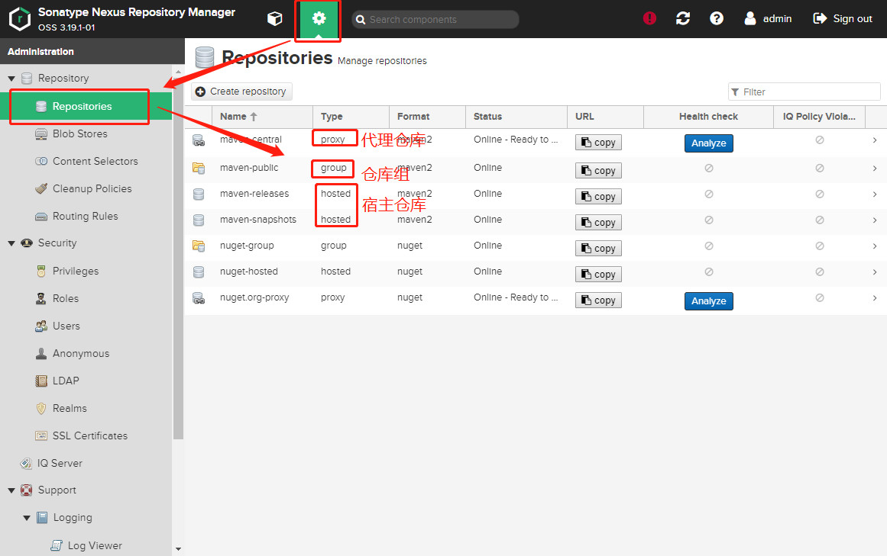
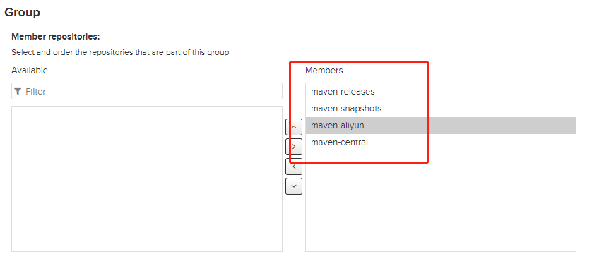

## 安装

+ 解压` tar -zvxf latest-unix.tar.gz `
+ 启动` nexus-3.19.1-01/bin/nexus start `

 **记得开放防火墙的8081端口**

访问8081端口

密码：` sonatype-work/nexus3/admin.password `

点击右上角sign in登录

## Nexus中仓库分类




### 代理仓库

​		代理仓库主要是让使用者通过代理仓库来间接访问外部的第三方远程仓库的，如通过代理仓库访问maven中央仓库、阿里的maven仓库等等。代理仓库会从被代理的仓库中下载构件，缓存在代理仓库中以供maven用户使用。

#### 创建阿里云的maven代理仓库


 点击底部的`Create repository`按钮，创建完成 

### 宿主仓库

宿主仓库主要是给我们自己用的，主要有2点作用

1. 将私有的一些构件通过nexus中网页的方式上传到宿主仓库中给其他同事使用
2. 将自己开发好一些构件发布到nexus的宿主仓库中以供其他同事使用

### 仓库组

maven用户可以从代理仓库和宿主仓库中下载构件至本地仓库，为了方便从多个代理仓库和宿主仓库下载构件，maven提供了仓库组，仓库组中可以有多个代理仓库和宿主仓库，而maven用户只用访问一个仓库组就可以间接的访问这个组内所有的仓库，仓库组中多个仓库是有顺序的，当maven用户从仓库组下载构件时，仓库组会按顺序依次在组内的仓库中查找组件，查找到了立即返回给本地仓库，所以一般情况我们会将速度快的放在前面。

仓库组内部实际上是没有构件内容的，他只是起到一个请求转发的作用，将maven用户下载构件的请求转发给组内的其他仓库处理。

nexus默认有个仓库组`maven-public`

> 我们点击maven-public代理仓库组。将刚创建的阿里云代理仓库加入到组中并置于中央仓库之上




## 配置本地Maven从nexus下载构件

### pom.xml方式

复制maven-public仓库组的地址

```xml
<repositories>
    <repository>
        <id>maven-nexus</id>
        <url>http://192.168.101.129:8081/repository/maven-public/</url>
        <releases>
            <enabled>true</enabled>
        </releases>
        <snapshots>
            <enabled>true</enabled>
        </snapshots>
    </repository>
</repositories>
```

> 由于nexus私服需要有用户名和密码登录才能访问，所以需要有凭证，凭证需要在settings.xml文件中配置，在`settings.xml`文件的`servers`元素中加入 
>
> ```xml
> <server>
>   <id>maven-nexus</id>
>   <username>admin</username>
>   <password>nexus</password>
> </server>
> ```
>
>  注意上面的`server->id`的值和`pom.xml中repository->id`的值一致，通过这个id关联找到凭证的。 

### 镜像方式

setting.xml:

```xml
<mirror>
  <id>mirror-nexus</id>
  <mirrorOf>*</mirrorOf>
  <name>nexus镜像</name>
  <url>http://192.168.101.129:8081/repository/maven-public/</url>
</mirror>
```

> ```xml
> <server>
>   <id>mirror-nexus</id>
>   <username>admin</username>
>   <password>nexus</password>
> </server>
> ```
>
>  注意上面的`server->id`的值和`mirror->id`的值需要一致，这样才能找到对应的凭证。 


## 使用maven部署构件至nexus私服

分别复制宿主仓库的 maven-releases 和 maven-snapshots 的地址

在pom.xml中添加：

```xml
<distributionManagement>
    <repository>
        <id>release-nexus</id>
        <url>http://192.168.101.129:8081/repository/maven-releases/</url>
        <name>nexus私服中宿主仓库->存放/下载稳定版本的构件</name>
    </repository>
    <snapshotRepository>
        <id>snapshot-nexus</id>
        <url>http://192.168.101.129:8081/repository/maven-snapshots/</url>
        <name>nexus私服中宿主仓库->存放/下载快照版本的构件</name>
    </snapshotRepository>
</distributionManagement>
```

在settings中配置认证：

```xml
<server>
  <id>release-nexus</id>
  <username>admin</username>
  <password>nexus</password>
</server>

<server>
  <id>snapshot-nexus</id>
  <username>admin</username>
  <password>nexus</password>
</server>
```

执行`mvn deploy`  会对构件进行打包，然后上传到私服中 

测试发现上传了快照的构建到快照的宿主仓库，我们可以修改pom文件的版本信息`<version>1.0-SNAPSHOT</version>`删除掉后面的-SNAPSHOT就可以发布稳定版本的构建了

去对应的私有仓库点击点击相关的jar包，右边会显示相关的maven依赖，别的小伙伴就可以拿来使用了哦


