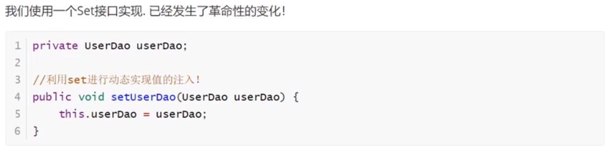

# 1、Spring

## 1.1.简介

+ Spring: _---->-给软件行业带来了春天!
+ 2002,首次推出了Spring框架的雏形: interface21框架!
+ Spring框架即以interface21框架为基础,经过重新设计 ,并不断丰富其内涵,于2004年3月24日发布了1.0正式
  版。
+ Rod Johnson，Spring Framework创始人， 著名作者。很难想象Rod Johnson的学历， 真的让好多人大吃一
  惊，他是悉尼大学的博士,然而他的专业不是计算机，而是音乐学。
+ spring理念: 使现有的技术更加容易使用，本身是- -个大杂烩，整合了现有的技术框架!


官网: https://spring.io/projects/spring-framework#learn

官方下载地址: http://repo.spring.io/release/org/springframework/spring
GitHub: https://github.com/spring:projects/spring-framework

```xml
<!-- https://mvnrepository.com/artifact/org.springframework/spring-webmvc -->
<dependency>
    <groupId>org.springframework</groupId>
    <artifactId>spring-webmvc</artifactId>
    <version>5.2.2.RELEASE</version>
</dependency>

```

spring的基本结构：

```xml
<?xml version="1.0" encoding="UTF-8"?>
<beans xmlns="http://www.springframework.org/schema/beans"
       xmlns:xsi="http://www.w3.org/2001/XMLSchema-instance"
       xsi:schemaLocation="http://www.springframework.org/schema/beans
	http://www.springframework.org/schema/beans/spring-beans.xsd">


    
</beans>
```


## 1.2、优点

+ Spring是一个开源的免费的框架(容器) !
+ Spring是一个轻量级的.非入侵式的框架!
+ 控制反转(I0C)，面向切面编程 (AOP) !
+ 支持事务的处理，对框架整合的支持!


**spring就是一个轻量级的控制反转（IOC）和面向切面编程（AOP）的框架**

## 1.3、组成


# 2、IOC理论推导

在我们之前的业务中，用户的需求可能会影响我们原来的代码,我们需要根据用户的需求去修改原代码!如果程序代码量十分大,修改一次的成本代价十分昂贵!



+ 之前，程序是主动创建对象!控制权在程序猿手上!
+ 使用了set注入后，程序不再具有主动性,而是变成了被动的接受对象!

这种思想，从本质上解决了问题，我们程序猿不用再去管理对象的创建了。系统的耦合性大大降低~，可以更加专注的在业务的实现上!这是IOC的原型!

## I0C本质

**控制反转loC(Inversion of Control),是一种设计思想，DI(依赖注入)是实现IoC的一种方法**,也有人认为DI只是IoC的另- -种说法。没有IoC的程序中,我们使用面向对象编程,对象的创建与对象间的依赖关系完全硬编码在程序中，对象的创建由程序自己控制，控制反转后将对象的创建转移给第三方，个人认为所谓控制反转就是:获得依赖对象的方式反转了。


采用XML方式配置Bean的时候，Bean的定义信息是和实现分离的，而采用注解的方式可以把两者合为一体,Bean的定义信息直接以注解的形式定义在实现类中，从而达到了零配置的目的。

**控制反转是一种通过描述(XML或注解)并通过第三方去生产或获取特定对象的方式。在Spring中实现控制反转的是IoC容器，其实现方法是依赖注入(Dependency Injection,DI)。**


控制:谁来控制对象的创建,传统应用程序的对象是由程序本身控制创建的,使用Spring后,对象是由Spring来创建的. .

反转:程序本身不创建对象,而变成被动的接收对象.

依赖注入:就是利用set方法来进行注入的.

I0C是一种编程思想,由主动的编程变成被动的接收.

可以通过newClassPathXmlApplicationContext去浏览一下底层源码 .

**所谓IOC（控制反转），一句话搞定：对象由spring来创建，管理，装配**


# 4、IOC创建对象方式

1.默认是使用无参构造对象！

```xml
<bean id="user" class="com.luo.model.User">
        <property name="name" value="luo"/>
    <!--property 中的value是给对象属性赋初始值 ref是给对象赋已经在spring容器注册的对象
		就是上面说的依赖注入利用set方法来注入
-->
    </bean>
```


2.如果要使用有参构造器

​	1.通过下标赋值

```xml
<bean id="user" class="com.luo.model.User">
        <constructor-arg index="0" value="jing"/>
        <constructor-arg index="1" value="20"/>
    </bean>
```

​	2.通过类型

```xml
<bean id="user" class="com.luo.model.User">
        <constructor-arg type="java.lang.String" value="jing"/>
    </bean>
```

​	3.直接通过参数名

```xml
<bean id="user" class="com.luo.model.User">
        <constructor-arg name="name" value="luo"/>
    </bean>
```

总结：在配置文件加载的时候，spring容器中管理的对象已经被初始化了，每次取的都是同一个对象

```java
ApplicationContext context = new ClassPathXmlApplicationContext("beans.xml");
        User user1 = (User) context.getBean("user");
        User user2 = (User) context.getBean("user");
        user1.setName("aaa");
        user2.setName("bbb");
        System.out.println(user1);
//返回结果User{name='bbb'}
```


# 5、spring配置

## 5.1别名

```xml
为一个对象取别名
<alias name="user" alias="user2"/>
```

## 5.2bean的配置

+ id : bean 的唯一 标识符，也就是相当于我们学的对象名
+ class : bean 对象所对应的全限定名:包名+类型
+ name: 也是别名，而且name 可以同时取多个别名

## 5.3import

这个import, 一般用于团队开发使用，他可以将多个配置文件,导入合并为一个，如果里面有相同的对象名，只会取一个

# 6、依赖注入

## 6.1构造器注入

前面提到的

## 6.2set方式注入

+ 依赖注入：本质Set注入！
  + 依赖：bean对象的创建依赖于容器！
  + 注入：bean对象中的所有属性，由容器来注入！

【环境搭建】

1.复杂类型

```java
public class Address {
    private String address;

    public String getAddress() {
        return address;
    }

```

2.真实测试对象

```java
public class Student {

    private String name;
    private Address address;
    private String[] books;
    private List<String> hobbys;
    private Map<String,String> card;
    private Set<String> games;
    private String wife;
    private Properties info;
```

3.beans.xml

```xml
<?xml version="1.0" encoding="UTF-8"?>
<beans xmlns="http://www.springframework.org/schema/beans"
       xmlns:xsi="http://www.w3.org/2001/XMLSchema-instance"
       xsi:schemaLocation="http://www.springframework.org/schema/beans
	http://www.springframework.org/schema/beans/spring-beans.xsd">

    <bean id="student" class="com.jing.model.Student">

        <!--第一个，普通值注入，value-->
        <property name="name" value="luo"/>

        <!--第二个，bean注入，ref-->
        <property name="address" ref="address"/>

        <!--数组注入-->
        <property name="books">
            <array>
                <value>第一本书</value>
                <value>第二本书</value>
                <value>第三本书</value>
            </array>
        </property>

        <!--List-->
        <property name="hobbys">
            <list>
                <value>第一个元素</value>
                <value>第二个元素</value>
            </list>
        </property>

        <!--map-->
        <property name="card">
            <map>
                <entry key="一" value="a"/>
                <entry key="二" value="b"/>
            </map>
        </property>

        <!--Set-->
        <property name="games">
            <set>
                <value>LOL</value>
                <value>王者</value>
            </set>
        </property>

        <!--null-->
        <property name="wife">
            <null/>
        </property>

        <!--Properties-->
        <property name="info">
            <props>
                <prop key="姓名">罗</prop>
                <prop key="年级">20</prop>
            </props>
        </property>

    </bean>

</beans>
```

4.测试类

```java
public class MyTest {
    public static void main(String[] args) {
        ApplicationContext context = new ClassPathXmlApplicationContext("beans.xml");
        Student student = (Student) context.getBean("student");
        System.out.println(student);
    }
}
```


## 6.3扩展方式注入

p命名和c 命名注入方式

```xml
<?xml version="1.0" encoding="UTF-8"?>
<beans xmlns="http://www.springframework.org/schema/beans"
       xmlns:xsi="http://www.w3.org/2001/XMLSchema-instance"
       xmlns:p="http://www.springframework.org/schema/p"
       xmlns:c="http://www.springframework.org/schema/c"
       xsi:schemaLocation="http://www.springframework.org/schema/beans
	http://www.springframework.org/schema/beans/spring-beans.xsd">


    <!--p命名空间注入，可以直接注入属性 set方式注入-->
    <bean id="user" class="com.jing.model.User" p:name="luo" p:age="20"/>

    <!--C命名空间注入，通过构造器注入-->
    <bean id="user2" class="com.jing.model.User" c:name="jing" c:age="18" />

</beans>
```

不能直接使用需要导入约束

```xml
xmlns:p="http://www.springframework.org/schema/p"
       xmlns:c="http://www.springframework.org/schema/c"
```

## 6.4bean的作用域

| ope                                                          | Description                                                  |
| :----------------------------------------------------------- | :----------------------------------------------------------- |
| [singleton](https://docs.spring.io/spring-framework/docs/current/spring-framework-reference/core.html#beans-factory-scopes-singleton) | (Default) Scopes a single bean definition to a single object instance for each Spring IoC container. |
| [prototype](https://docs.spring.io/spring-framework/docs/current/spring-framework-reference/core.html#beans-factory-scopes-prototype) | Scopes a single bean definition to any number of object instances. |
| [request](https://docs.spring.io/spring-framework/docs/current/spring-framework-reference/core.html#beans-factory-scopes-request) | Scopes a single bean definition to the lifecycle of a single HTTP request. That is, each HTTP request has its own instance of a bean created off the back of a single bean definition. Only valid in the context of a web-aware Spring `ApplicationContext`. |
| [session](https://docs.spring.io/spring-framework/docs/current/spring-framework-reference/core.html#beans-factory-scopes-session) | Scopes a single bean definition to the lifecycle of an HTTP `Session`. Only valid in the context of a web-aware Spring `ApplicationContext`. |
| [application](https://docs.spring.io/spring-framework/docs/current/spring-framework-reference/core.html#beans-factory-scopes-application) | Scopes a single bean definition to the lifecycle of a `ServletContext`. Only valid in the context of a web-aware Spring `ApplicationContext`. |
| [websocket](https://docs.spring.io/spring-framework/docs/current/spring-framework-reference/web.html#websocket-stomp-websocket-scope) | Scopes a single bean definition to the lifecycle of a `WebSocket`. Only valid in the context of a web-aware Spring `ApplicationContext`. |

1.单例模式（spring默认机制）

```xml
    <bean id="user" class="com.jing.model.User" p:name="luo" p:age="20" scope="singleton"/>
```

2.原型模式：每次从容器中取对象的时候取到的都是一个新的对象

```xml
<bean id="user" class="com.jing.model.User" p:name="luo" p:age="20" scope="prototype"/>
```

3.其他的只能在web开发中用到

# 7、bean 的自动装配

+ 自动装配是spring满足bean依赖的一种方式
+ Spring会在上下文中自动寻找，并自动给bean装配属性!

在spring中有三种装配的方式

1.在xml中显示的配置（普通的配置文件）

2.在Java中显示配置（Java配置类）

3.隐式的自动装配bean

## 7.1、测试

1.环境搭建

+ 一个人两个宠物

## 7.2、ByName自动装配

```xml
<bean id="dog" class="com.jing.model.Dog"/>
    <bean id="cat" class="com.jing.model.Cat"/>

    <!--
    byName:会自动在容器上下文中查找，和自己对象set方法后面的值对应的id值
    -->
    <bean id="people" class="com.jing.model.People" autowire="byName">
        <property name="name" value="luo"/>
    </bean>
```

## 7.3、ByType自动装配

```xml
<bean id="dog" class="com.jing.model.Dog"/>
    <bean id="cat1aaaaaaaaaaa" class="com.jing.model.Cat"/>

    <!--
    byName:会自动在容器上下文中查找，和自己对象set方法后面的值对应的id值
    byType:会自动在容器上下文中查找，和自己对象属性类型相同的bean !
    -->
    <bean id="people" class="com.jing.model.People" autowire="byType">
        <property name="name" value="luo"/>
    </bean>
```

小结:

+ byname的时候，需要保证所有bean的id唯一 ， 并且这个bean需要和自动注入的属性的set方法的值一致!
+ bytype的时候，需要保证所有bean的class唯一， 并且这个bean需要和自动注入的属性的类型一致!

## 7.4、使用注解实现自动装配

1.导入约束

2.配置注解的支持

```xml
<?xml version="1.0" encoding="UTF-8"?>
<beans xmlns="http://www.springframework.org/schema/beans"
    xmlns:xsi="http://www.w3.org/2001/XMLSchema-instance"
    xmlns:context="http://www.springframework.org/schema/context"
    xsi:schemaLocation="http://www.springframework.org/schema/beans
        https://www.springframework.org/schema/beans/spring-beans.xsd
        http://www.springframework.org/schema/context
        https://www.springframework.org/schema/context/spring-context.xsd">

    <context:annotation-config/>

</beans>
```


**@Autowired**

直接在属性上使用即可!也可以在set方式上使用!

使用Autowired我们可以不用编写Set方法了,前提是你这个自动装配的属性在I0C (Spring) 容器中存在，且符
合名字byname!

如果@Autowired自动装配的环境比较复杂，自动装配无法通过一个注解[@Autowired]完成的时候、我们可以
使用_@Qualifier(value="xxx" )_去配置@Autowired的使用，指定一个唯一的bean对象注入!

# 8、使用注解开发

```xml
<?xml version="1.0" encoding="UTF-8"?>
<beans xmlns="http://www.springframework.org/schema/beans"
       xmlns:xsi="http://www.w3.org/2001/XMLSchema-instance"
       xmlns:context="http://www.springframework.org/schema/context"
       xsi:schemaLocation="http://www.springframework.org/schema/beans
	        http://www.springframework.org/schema/beans/spring-beans.xsd
            http://www.springframework.org/schema/context
            https://www.springframework.org/schema/context/spring-context.xsd">

    <!--指定要扫描的包(包下的组件)，在这个包下的注解就会生效-->
    <context:component-scan base-package="com.jing.model"/>
    <context:annotation-config/>


</beans>
```

1.bean

2.属性注入

```java
@Component
public class User {
    @Value("jing")
    private String name;

    @Override
    public String toString() {
        return "User{" +
                "name='" + name + '\'' +
                '}';
    }
}
```

3.衍生的注解

@Component有几个衍生的注解，我们在web开发中，会按照MVC三层架构分层

+ dao层 【@Repository】

+ service层 【@Service】

+ contorller层 【@Controller】

  这四个注解功能都是一样的，都是代表将某个类注册到spring容器中，来装配bean!

4.自动装配

5.作用域

在类上加入`@Scope("singleton")`设置为单例/原型模式

6.小结

​	xml与注解对比：

+ xml更加万能，适用于任何场景，维护方便
+ 注解，不是自己的类使用不了需要装配上，维护复杂
+ 策略：
  + xml用来管理bean
  + 注解只负责属性的注入
  + 开发时需要注意，开启注解支持

# 9、使用Java来配置spring

如果完全使用了配置类方式去做，我们就只能通过AnnotationConfig 上:下文来获取容器，通过配置类的class对象加载!

```java
ApplicationContext context = new AnnotationConfigApplicationContext(MyConfig.class);
        User getUser = context.getBean("getUser", User.class);
```

myconfig.java文件：

```java
package com.jing.config;

import com.jing.model.User;
import org.springframework.context.annotation.Bean;
import org.springframework.context.annotation.ComponentScan;
import org.springframework.context.annotation.Configuration;
import org.springframework.context.annotation.Import;

@Configuration
@ComponentScan("com.jing")//扫描组件
@Import(MyConfig2.class)//为了引入其他配置类
public class MyConfig {

    @Bean//相当于xml里的bean标签，这个类相当于beans标签
    public User getUser(){
        return new User();
    }
}
```


# 10、代理模式

为什么要学习代理模式?因为这是SpringAOP的底层! （面向切面编程的实现）

代理模式分类：

+ 静态代理

+ 动态代理

  

## 10.1、静态代理

角色分析：

+ 抽象角色 ：一般会使用接口或者抽象类来解决
+ 真实角色：被代理的角色
+ 代理角色：代理真实角色，代理真实角色后，一般会做一些附属操作
+ 客户：访问代理对象的人

静态代理模式的好处：

+ 可以使真实角色的操作更加纯粹! 不用去关注一些公共的业务
+ 公共也就是交给代理角色！实现了业务的分工！
+ 公共业务发生扩展的时候，方便集中管理！

缺点：

+ 一个真实角色就会产生一个代理角色；代码量会翻倍，开发效率会变低

## 10.2、动态代理

+ 动态代理和静态代理角色一样
+ 动态代理的代理类是动态生成的，不是我们直接写好的!
+ 动态代理分为两大类:基于接口的动态代理，基于类的动态代理
  + 基于接口--- JDK动态代理[我们在这里使用]
  + 基于类: cglib
  + java字节码实现: javasist

需要了解两个类：proxy：代理，InvocationHandler：调用处理程序


动态代理的好处：

+ 可以使真实角色的操作更加纯粹! 不用去关注一些公共的业务
+ 公共也就是交给代理角色！实现了业务的分工！
+ 公共业务发生扩展的时候，方便集中管理！
+ 一个动态代理类代理的就是一个接口，一般就是对应的一类业务
+ 一个动态代理类可以代理多个类，只要是实现了同一个接口

# 11、AOP

## 11.1、什么是AOP

AOP (Aspect Oriented Programming)意为:面向切面编程，通过预编译方式和运行期动态代理实现程序功能的统一维护的- -种技术。AOP是0OP的延续,是软件开发中的一个热点，也是Spring框架中的一-个重要内容,是函数式编程的一种衍生范型。利用AOP可以对业务逻辑的各个部分进行隔离，从而使得业务逻辑各部分之间的耦合度降低,提高程序的可重用性，同时提高了开发的效率。

## 11.2、AOP在spring中的作用

## 11.3、使用Spring实现AOP

需要导入：

```xml
<dependency>
            <groupId>org.aspectj</groupId>
            <artifactId>aspectjweaver</artifactId>
            <version>1.9.4</version>
        </dependency>
```

方式一：使用Spring的API接口

方式二：自定义实现AOP

方式三：使用注解实现！

# 12、整合Mybatis

步骤

1.导入相关jar包

+ Junit
+ mybatis
+ MySQL数据库
+ Spring相关的
+ aop织入
+ mybatis-spring

2.编写配置文件

3.测试

## 12.1、回忆mybatis

1.编写实体类

2.编写核心配置文件

3.编写接口

4.编写Mapper.xml

5.测试

