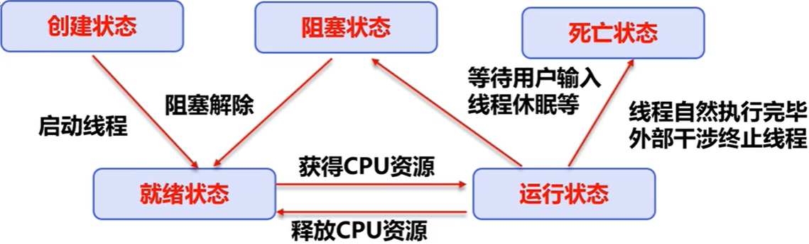
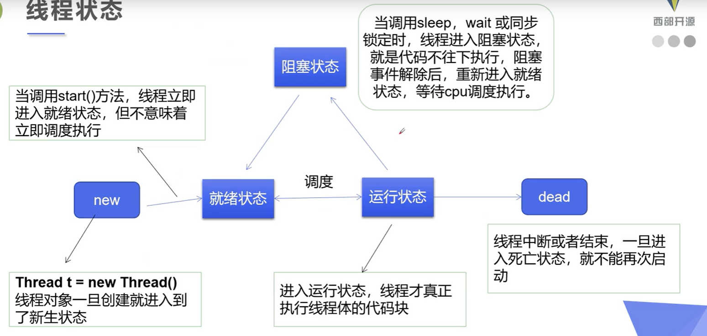

# 线程简介

+ 说起进程，就不得不说下程序。**程序**是指令和数据的有序集合,其本身没有任何运行的含义，是一个静态的概念。
+ 而**进程**则是执行程序的一次执行过程，它是一个动态的概念。是系统资源分配的单位
+ 通常在一个**进程**中可以**包含若干个线程**，当然一个进程中至少有一个线程,不然没有存在的意义。
+ 线程是CPU调度和执行的的单位。

> 注意:很多多线程是模拟出来的，真正的多线程是指有多个cpu,即多核，如服务器。
>
> 如果是模拟出来的多线程，即在一个cpu的情况下，在同一个时间点，cpu只能执行一个代码，
>
> 因为切换的很快，所以就有同时执行的错局。

# 线程实现（重点）

+ 继承Thread类
  + 自定义线程类继承Thread类
  
  + 重写run（）方法，编写线程执行体
  
  + 创建线程对象，调用start（）方法启动线程
  
  + ```java
    package com.jing.demo1;
    
    public class TestThread1 extends Thread {
    
        @Override
        public void run() {
            //run方法线程体
            System.out.println("我是run方法里的线程");
        }
    
        public static void main(String[] args) {
    
            //创建一个线程对象
            TestThread1 thread1 = new TestThread1();
            //调用start方法开启线程
            thread1.start();
    
            for (int i=0;i<100;i++){
                System.out.println("我是主方法的线程");
            }
    
        }
    }
    
    ```
  
  + 并不是run方法的先执行，所以两个线程互不影响
  
+ 实现Runnable接口

  + 自定义线程类继承Runnable类

  + 实现run（）方法，编写线程执行体

  + 创建线程对象，调用start（）方法启动线程

  + ```java
    package com.jing.demo1;
    
    public class TestThread3 implements Runnable{
    
        @Override
        public void run() {
            System.out.println("我是run方法里的线程");
        }
    
        public static void main(String[] args) {
            TestThread3 thread3 = new TestThread3();
            new Thread(thread3).start();
        }
    }
    
    ```

  + ```java
    package com.jing.demo1;
    
    //多个线程操作同一个对象资源，例如抢票
    //会出现同一个线程抢到同一张票的问题，线程不安全
    public class TestThread4 implements Runnable {
        private int num = 10;
    
        @Override
        public void run() {
            while (true){
                if(num<=0){
                    break;
                }
                try {
                    Thread.sleep(300);
                } catch (InterruptedException e) {
                    e.printStackTrace();
                }
                System.out.println(Thread.currentThread().getName()+"--->拿到了第"+num--+"张票");
            }
        }
    
        public static void main(String[] args) {
            TestThread4 thread4 = new TestThread4();
    
            new Thread(thread4,"A").start();
            new Thread(thread4,"B").start();
            new Thread(thread4,"C").start();
        }
    }
    
    ```

+ 实现Callable接口(了解即可)

  + 1.实现Callable接口， 需要返回值类型

  + 2.重写call方法， 需要抛出异常

  + 3.创建目标对象

  + 4.创建执行服务: ExecutorService ser = Executors.newFixedThreadPool(1);

  + 5.提交执行: Future<Boolean> result1 = ser.submit(t1);

  + 6.获取结果: boolean r1 = result1.get()

  + 7.关闭服务: ser.shutdownNow();

  + ```java
    package com.jing.demo2;
    
    import java.util.concurrent.*;
    
    public class TestCallAble implements Callable<Boolean> {
        @Override
        public Boolean call() throws Exception {
            System.out.println("我是call里面的方法");
            return true;
        }
    
        public static void main(String[] args) throws ExecutionException, InterruptedException {
            //3.创建目标对象
            TestCallAble testCallAble = new TestCallAble();
            
            //4.创建执行服务:
            ExecutorService ser = Executors.newFixedThreadPool(1);
            //5.提交执行:
            Future<Boolean> result1 = ser.submit(testCallAble);
            //6.获取结果:
            boolean r1 = result1.get();
            //7.关闭服务:
            ser.shutdownNow();
        }
    }
    
    ```

# Lamda表达式

**函数式接口：**一个接口只有一个抽象方法的接口称为函数式接口

Lamda表达式用于简化函数式接口的实现类

```java
package com.jing.Lamda;

public class TestLamda {
    public static void main(String[] args) {
        Sayhello sayhello = null;
        sayhello = (name,age)->{
            System.out.println(name+"你好"+age+"岁");
        };
        sayhello.hello("静",18);
    }
}

interface Sayhello{

    void hello(String name,int age);
}
```

注意点：

+ 实现类的接口必须是**函数式接口**
+ 当实现的代码只有一行时才可以省略大括号
+ 当参数只有一个时才可以省略小括号，参数类型可以省略

# 线程状态






|             方法             | 说明 |
| :------------------------| :-- |
| setPriority(int newPriority) | 更改线程的优先级 |
| static void sleep(long millis) | 在指定的毫秒数内让正在执行的线程休眠 |
| void join() | 等待该线程终止 |
| static void yield() | 暂停正在执行的线程对象，并执行其他线程 |
| void interrupt() | 中断线程 |
| boolean isAlive() | 测试线程是否处于活动状态 |

## 停止线程

+ 建议线程正常停止
+ 建议使用一个标志位来停止 `flag`
+ 不要使用stop或者destroy等过时或者jdk不建议使用的方法

```java
package com.jing.demo2;

public class TestStop implements Runnable {

    //用来控制线程的停止
    private Boolean flag = true;

    @Override
    public void run() {
        int i = 0;
        while (flag){
            System.out.println("线程正在运行。。。"+i++);
        }
    }

    
    public void stop(){
        flag = false;
    }

    public static void main(String[] args) throws InterruptedException {
        TestStop testStop = new TestStop();
        new Thread(testStop).start();

        Thread.sleep(10);
        testStop.stop();
    }
}
```

## 线程休眠

+ sleep（时间）指定当前线程阻塞的毫秒数
+ sleep存在InterruptedException异常
+ sleep时间达到后线程就进去就绪状态
+ sleep可以模拟网络延时。倒计时等
+ 每个对象都有一个锁，sleep不会释放锁

## 线程礼让（yield）

+ 礼让线程，让当前正在执行的线程暂停，但不阻塞

+ 将线程从运行状态转为就绪状态

+ 让CPU重新调度，礼让不一定成功

  + ```java
    package com.jing.demo2;
    
    public class TestYield {
        public static void main(String[] args) {
            MyYield myYield = new MyYield();
    
            new Thread(myYield,"A").start();
            new Thread(myYield,"B").start();
    
        }
    }
    
    class MyYield implements Runnable{
    
        @Override
        public void run() {
            System.out.println(Thread.currentThread().getName()+"线程开始执行！");
           Thread.yield();//礼让
            System.out.println(Thread.currentThread().getName()+"线程结束执行！");
        }
    }
    ```

  + 结果：

    + ```
      B线程开始执行！
      A线程开始执行！
      B线程结束执行！
      A线程结束执行！
      ```

## Join

+ join合并线程，待此线程执行完成后，再执行其他线程。其他线程阻塞

+ 可以理解成插队

+ ```java
  package com.jing.demo2;
  
  public class TestJoin implements Runnable {
      @Override
      public void run() {
          for (int i =0;i<100;i++){
              System.out.println("我是VIP线程"+i);
          }
      }
  
      public static void main(String[] args) throws InterruptedException {
          TestJoin testJoin = new TestJoin();
          Thread thread = new Thread(testJoin);
          thread.start();
  
          for (int j = 0;j<250;j++){
              if(j == 200){
                  //在200的时候另一个线程来插队
                  thread.join();
              }
              System.out.println("我是主线程");
          }
      }
  }
  
  ```

## 线程状态观测

+ Thread.State

+ 线程状态。线程可以处于下列状态之一： 

  - [`NEW`](../../java/lang/Thread.State.html#NEW)
    至今尚未启动的线程处于这种状态。 
  - [`RUNNABLE`](../../java/lang/Thread.State.html#RUNNABLE)
    正在  Java 虚拟机中执行的线程处于这种状态。 
  - [`BLOCKED`](../../java/lang/Thread.State.html#BLOCKED)
    受阻塞并等待某个监视器锁的线程处于这种状态。 
  - [`WAITING`](../../java/lang/Thread.State.html#WAITING)
    无限期地等待另一个线程来执行某一特定操作的线程处于这种状态。 
  - [`TIMED_WAITING`](../../java/lang/Thread.State.html#TIMED_WAITING)
    等待另一个线程来执行取决于指定等待时间的操作的线程处于这种状态。 
  - [`TERMINATED`](../../java/lang/Thread.State.html#TERMINATED)
    已退出的线程处于这种状态。 

  在给定时间点上，一个线程只能处于一种状态。这些状态是虚拟机状态，它们并没有反映所有操作系统线程状态。

  ```java
  package com.jing.demo2;
  
  public class TestState {
  
      public static void main(String[] args) {
          Thread thread = new Thread(()->{
              for(int i=0;i<5;i++){
                  try {
                      Thread.sleep(1000);
                  } catch (InterruptedException e) {
                      e.printStackTrace();
                  }
              }
              System.out.println("---------**************-------------");
          });
  
          //获取thread线程此时的状态
          Thread.State state = thread.getState();
          System.out.println("未开始的状态"+state);
  
          //开启线程
          thread.start();
  
          //在开启之后获取当前线程状态
          state = thread.getState();
          System.out.println("当前的状态"+state);
          
          while(state!=Thread.State.TERMINATED){//只要该线程没有停止就一直运行
              state = thread.getState();
             // System.out.println("当前的状态"+state);
          }
  
          if (state==Thread.State.TERMINATED){
              System.out.println("当前的状态"+state);
              System.out.println("thread线程停止了");
          }
      }
  }
  
  ```

## 线程优先级

+ java提供一个**线程调度器**来监控程序中启动后进入就绪状态的所有线程，**线程调度器**按照优先级决定应该调度哪个线程来执行
+ 线程的优先级用数字表示，范围从1~10.
  + Thread.MIN_PRIORITY = 1;
  + Thread.MAX_PRIORITY = 10;
  + Thread.NORM_PRIORITY = 5;
+ 使用以下方式改变或获取优先级
  + getPriority()
  + setPriority(int xxx)

# 线程同步（重点）


# 线程通信问题


# 高级主题

